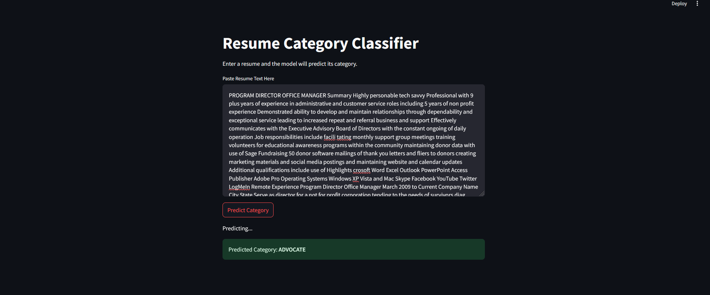
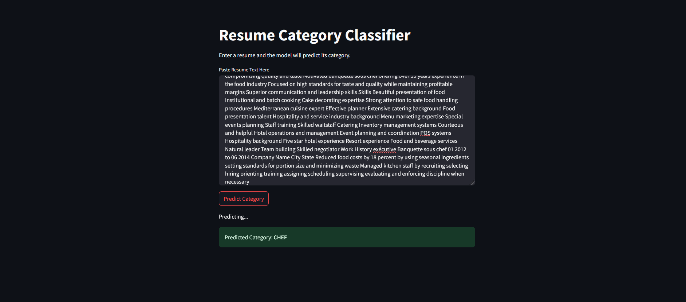

# Multi-class Text Classification

## Resume Classification Application

This project is a multi-class text classification application designed to identify the category of resumes based on their descriptions. The application is built using machine learning techniques and features a user-friendly interface for predictions. The dataset used is sourced from Kaggle: [Resume Dataset](https://www.kaggle.com/datasets/snehaanbhawal/resume-dataset/data).

---

## Table of Contents
- [Description](#description)
- [Environment Setup](#environment-setup)
- [File Execution Workflow](#file-execution-workflow)
- [Output](#output)
- [Hosting and Deployment](#hosting-and-deployment)
---

## Description

The application processes resume data, trains a multi-class text classification model, and provides a user-friendly interface to predict the category of resumes. The dataset contains multiple categories of resumes to facilitate accurate classification.

---

## Environment Setup

### Create a Virtual Environment
Use Conda to create and activate a Python 3.10 environment for this project:
```bash
conda create --name resume_classification python=3.10
conda activate resume_classification
pip install -r requirements.txt
```
## File Execution Workflow

### Data Cleaning
Run the clean_resume.py script to clean and preprocess the input data:

```bash
python3 clean_resume.py
```

### Data Preprocessing

Run the preprocess_data.py script to prepare the cleaned data for model training:
```bash
python3 preprocess_data.py
```

### Model Training

Train the multi-class classification model using the train_model.py script:
```bash
python3 train_model.py
```

### Application Deployment

Launch the application with the deploy_app.py script to start the Streamlit interface for inference:
```bash
python3 deploy_app.py
```

## Output
Below is an example of the application interface showing the resume classification output:



## Hosting and Deployment
This application is hosted using GitHub and Cloud Connect for seamless access and deployment. Ensure all required files are included in your repository for smooth hosting.

